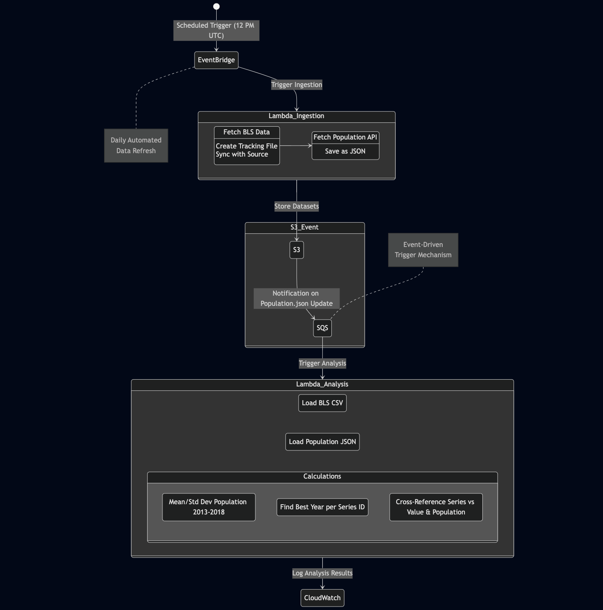

# Coding Quest: Automated Data Ingestion & Analysis

## Overview
This project automates the end-to-end data ingestion and analysis pipeline using AWS Lambda, S3, EventBridge, SQS, and Terraform. The solution efficiently ingests and processes BLS and Population datasets, ensuring synchronization and structured analytics execution.

## Project Structure
```
rearc_quest/
├── artifacts/              # Packaged code for Lambda deployment
├── data/                   # Local data storage
│   ├── bls/                # Bureau of Labor Statistics data
│   └── population/         # Population API data
├── deployment/             # Terraform infrastructure modules
│   ├── modules/
│   │   ├── eventbridge_lambda/
│   │   ├── iam/
│   │   ├── iam_policy/
│   │   ├── lambda/
│   │   ├── s3/
│   │   ├── s3_event/
│   │   ├── s3_policy/
│   │   ├── sqs/
│   │   └── sqs_policy/
│   └── *.tf files
├── notebooks/              # Jupyter notebooks for analysis
├── src/                    # Source code
│   ├── __init__.py
│   ├── analyze/
│   ├── ingest/
│   ├── main.py
│   └── utils/
├── Makefile                # Automation commands for setup, execution, package & deploy
├── local-config.yaml       # Local execution configuration
├── aws-config.yaml         # AWS-based configuration (for S3 based filepath execution)
├── requirements.txt        # Dependencies for local execution
└── base-requirements.txt   # Dependencies for AWS Lambda layer
```

## Code Setup
- The `Makefile` automates local setup, execution, and deployment.
- Provides commands for (leverage `make help`):
  - Setting up the environment
  - Running ingestion & analysis locally
  - Packaging the code and dependencies for Lambda deployment
- Supports execution via `local-config.yaml` (local paths) and `aws-config.yaml` (AWS S3 paths). To support this, the file and dataframe utility modules ensure to handle the execution basis if they are local/s3 specific.
- Analysis notebook `bls-population-analysis.ipynb` in `notebooks/` leverage the `src/` code for analysis.
- Local environment setup leverages `requirements.txt` vs lambda external dependency layer leveraging `base-requirements.txt`.

## Infrastructure Setup
- **Modularized Terraform scripts** in `deployment/` to create:
  - **S3**: Stores ingested data and config file
  - **EventBridge**: Schedules daily ingestion
  - **SQS**: Triggers analysis upon data updates
  - **Lambda**: Runs ingestion and analysis
  - **IAM and Policies**: Provides necessary permissions and accesses
- Deploys artifacts (code and dependencies) to Lambda.
- Restricted Public access to `s3://dev-rearc-bucket/data/` which can be listed via:

  ```sh
  aws s3 ls s3://dev-rearc-bucket/data/ --no-sign-request
  ```

## Execution Steps
1. **Refer to help command:** `make help`
2. **Prepare local environment:** `make install`
3. **Activate virtual environment:** `make activate`
4. **Run BLS data ingestion:** `make ingest-bls`
5. **Run Population data ingestion:** `make ingest-population`
6. **Run data analysis:** `make run-analysis`
7. **Package code for Lambda deployment:** `make package`
8. **Deploy AWS infrastructure:** `make deploy`
8. **Trigger Lambda execution manually or wait for EventBridge schedule (12 PM UTC).**

## Execution Flow


- **Lambda execution (manual/EventBridge) → Triggers `run_type=ingest` mode → BLS & Population data ingested into S3.**
- **Config validation ensures integrity before ingestion or analysis.**
- **BLS ingestion maintains an SCD Type 2 tracking file to track data changes and only ingest relevant data to keep the source and target in sync.**
- **S3 event notification triggers SQS upon `population.json` update.**
- **SQS triggers Lambda for analysis, identified via `run_type=analyze`.**
- **Analysis results are logged in CloudWatch.**
- **Robust exception handling ensures clear debugging messages.**